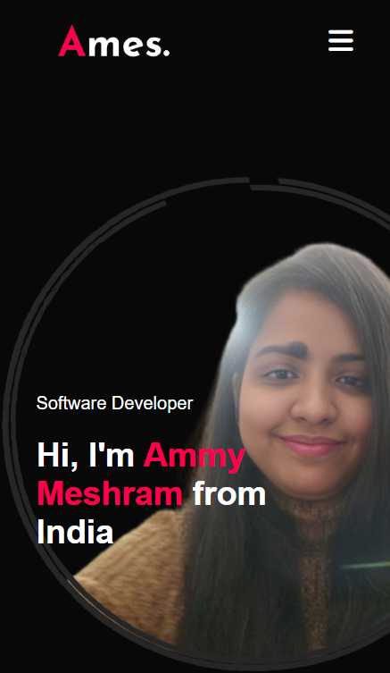

# Portfolio Website  

A modern, responsive **portfolio website** built using **HTML, CSS, and JavaScript** to showcase my skills, projects, and experience.  

 

---

## Features  
- **Responsive Design** – Works seamlessly across desktops, tablets, and mobiles  
- **Modern UI/UX** – Clean design with smooth hover effects and transitions  
- **Sections Included**:  
  - **Home** – Introduction with name & role  
  - **About Me** – Education, experience, and skills  
  - **Services** – Web development, UI/UX design, and App design  
  - **Portfolio** – Showcase of projects with interactive hover layers  
  - **Contact** – Google Sheets–integrated contact form with success message feedback  
- **Downloadable CV** – One-click resume access  
- **Social Links Integration** – LinkedIn, Instagram, and Facebook  

---

## Tech Stack  
- **HTML5**  
- **CSS3** (Flexbox, Grid, Media Queries for responsiveness)  
- **JavaScript (Vanilla JS)**  
- **Google Sheets API** for storing contact form submissions  

---

## Live Demo  
🔗 [View Portfolio Website]([https://skyvv4lker.github.io/Personal-Portfolio-Website/])   

---

## Preview  
| Desktop View | Mobile View |  
|--------------|-------------|  
|  |  |   

---

## Contact  
Feel free to connect with me:  
- **Email**: [ammymesh2263@gmail.com](mailto:ammymesh2263@gmail.com)  
- **LinkedIn**: [Ammy Meshram](https://www.linkedin.com/in/ammymeshram/)  

---

## License  
This project is licensed under the **MIT License** – you are free to use, modify, and distribute with attribution.  

---

If you like this project, don’t forget to **star the repo**!  
